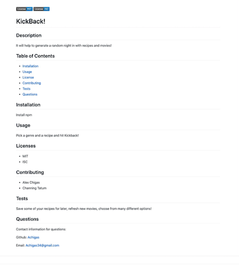

   

# README Generator

## Description
This project will generate a profesional README.md document for a user. 

## Table of Contents

* [Installation](#installation)
* [Usage](#usage)
* [License](#license)
* [Screenshot](#screenshot)
* [Contributing](#contributing)
* [Tests](#tests)
* [Questions](#questions)

## Installation
Install npm (Inquirer and fs)

## Usage
Answer questions that are provided. When entering the contributors, use a comma-delimited list for correct formatting.

## Screenshot

## Licenses
* MIT  
* Apache  
* ISC  
* OBSD

## Contributing
* Alex Chigas

## Tests
Run 'node index.js' to start the program. User will be prompted with questions.

## Questions
Contact information for questions:  

Github: [Achigas](https://www.github.com/Achigas)  

Email: Achigas34@gmail.com
